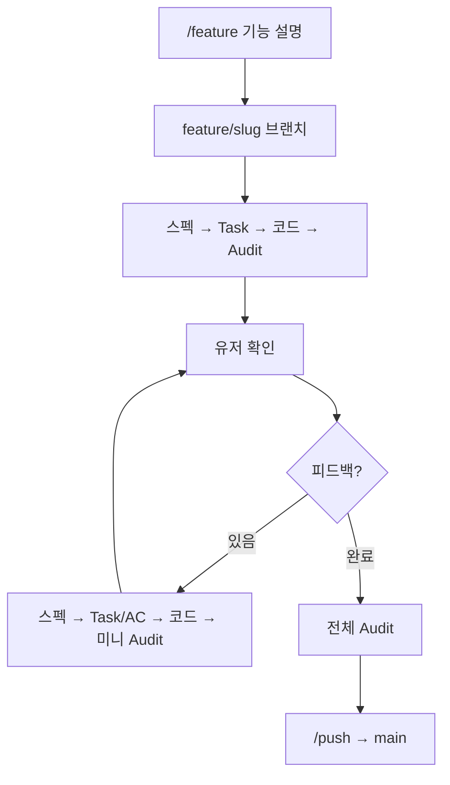

# 캣타워 카지노 (가칭)

고양이들이 운영하는 캣타워 카지노를 등반하며, 특수 주사위를 수집·조합하고 최상층 금고를 노리는 **주사위 로그라이크** 프로젝트.

## 문서

| 구분 | 링크 |
|------|------|
| 기획 | [게임 기획 문서](docs/gdd-cat-tower-casino.md) |
| 백로그 | [할 일·아이디어](docs/backlog.md) |
| 설계 | [설계 문서](docs/design/README.md) · [v0.1 초기 플레이어블](docs/design/v0.1-initial-playable.md) |
| 시스템 스펙 | [족보 계산 v2](docs/design/systems/hand-scoring-v2.md) (정본) |
| 참고 | [데이터 계층](docs/data-hierarchy.md) · [Godot 폴더 상세](docs/godot-project-layout.md) |

## 저장소 구조

```text
Dice/                          # Git 루트 — Cursor에서 이 폴더를 연다
├── docs/                      # 기획·설계 (Godot res 밖)
│   ├── gdd-*.md               # 기획
│   └── design/                # 구현 설계
├── scripts/                   # Git 셸 (start-feature, push-feature, …)
├── .cursor/                   # Rules, Skills
├── AGENTS.md                  # Agent 요약
├── README.md
│
└── game/                      # Godot 프로젝트 (project.godot)
    ├── project.godot
    ├── data/                  # JSON 카탈로그 → res://data/
    │   └── registry.json
    ├── scenes/
    │   ├── game/              # 런·층·라운드·상점
    │   ├── ui/                # HUD, 메뉴
    │   └── dice/              # 굴림·결과 연출
    ├── scripts/
    │   ├── autoload/          # DataRegistry, RunManager, …
    │   ├── core/              # 점수·칩·런 로직
    │   ├── ui/
    │   └── dice/
    ├── resources/             # .tres (JSON 이전 후)
    │   ├── dice/
    │   └── items/
    └── assets/
        ├── images/
        └── sounds/
```

## Godot 실행

**엔진 버전: [4.7 stable](https://godotengine.org/download/archive/4.7-stable/)** (팀 고정 — 다른 마이너 사용 금지)

1. Godot **4.7** 설치
2. **Import** → `game/project.godot` 열기
3. **Run Project** (F5) — 메인 씬: `scenes/game/main.tscn`

## 게임 데이터

정적 정의: [`game/data/`](game/data/) · 진입점 `game/data/registry.json`

## Feature 개발 워크플로



| 단계 | 명령 / 동작 |
|------|-------------|
| 시작 | **`/feature`** — 에이전트가 `feature/<slug>` 브랜치 생성 후 문서·구현 |
| 피드백 | 평문으로 전달 (별도 스킬 불필요). 매번 스펙 → Task → 코드 순 |
| 완료 | **`/push`** — 스펙·Task·diff 정합성 확인 후 커밋 + main merge |

상세 다이어그램·문서 계층·금지 사항: **[Feature 워크플로](docs/design/feature-workflow.md)**

```bash
./scripts/start-feature.sh dice-roll          # 수동 브랜치 시작 (선택)
./scripts/push-feature.sh -m "feat: ..."      # /push 와 동일
```

`origin/main` 갱신 시 push 스크립트 **중단** → `git merge main` → 재실행.

### Feature 범위

- 기획: GDD만 · 개발 범위: `feature/<slug>` 브랜치명·합의
- 예: `feature/shop-ui` → `game/scenes/ui/`, `game/scenes/game/shop*`, `game/scripts/ui/`

## Git

`feature/*` → `main`, PR 필수 아님. 상세: [AGENTS.md](AGENTS.md), `.cursor/rules/`

## 저장소

https://github.com/NyongNyongNyong/cat_dice_game
