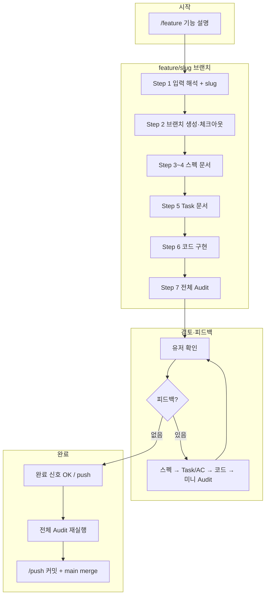
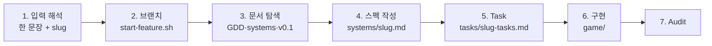
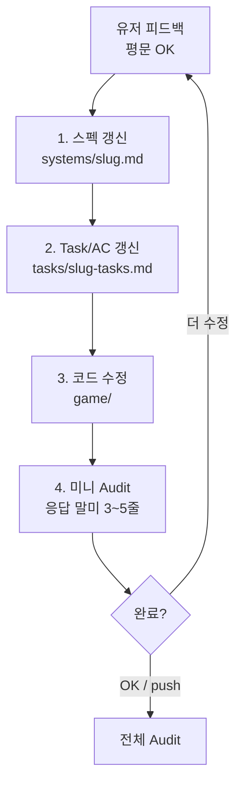
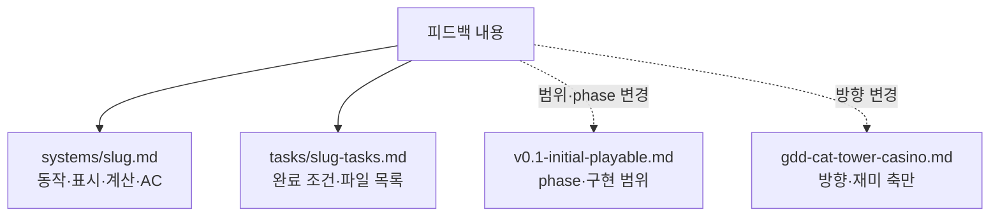
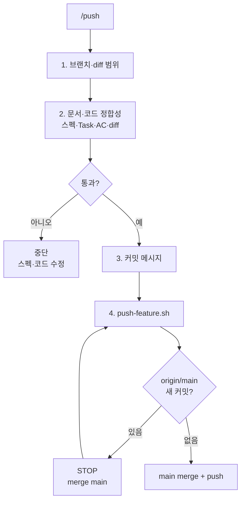

# Feature 개발 워크플로

> **정본:** Cursor `/feature` 스킬 · `.cursor/rules/feature-scope.mdc`  
> **브랜치:** `feature/<slug>` 에서만 문서·코드 편집 · 완료 시 `/push`

---

## 1. 전체 플로우 (한눈에)



피드백은 **별도 스킬 입력 없이** 평문으로 주면 된다 (`feature-scope` rule이 `feature/*` 브랜치에서 자동 적용).

---

## 2. `/feature` 상세 단계



| Step | 산출물 | 경로 예 |
|------|--------|---------|
| 2 | Git 브랜치 | `feature/dice-hover-reroll-preview` |
| 4 | 시스템 스펙 | `docs/design/systems/<slug>.md` |
| 5 | Task | `docs/design/tasks/<slug>-tasks.md` |
| 6 | Godot 코드·씬 | `game/scripts/`, `game/scenes/` |

**모든 편집(문서·Task·코드)은 Step 2 이후 `feature/<slug>`에서만** 한다.

---

## 3. 피드백 라운드



### 문서 계층 (무엇을 고칠지)



| 변경 유형 | 우선 수정 |
|-----------|-----------|
| 표시 형식, Hover 조건, 계산 방식 | `docs/design/systems/<slug>.md` |
| 완료 조건, 수정 파일 | `docs/design/tasks/<slug>-tasks.md` |
| phase·플레이어블 범위 | `docs/design/v0.1-initial-playable.md` |
| 게임 방향·재미 축 | `docs/gdd-cat-tower-casino.md` |

**수정 금지 (피드백으로도 변경하지 않음):** `hand-scoring-v2.md` 족보 규칙, 점수 공식, 리롤 비용·횟수 규칙 — 별도 feature·이슈로 분리.

---

## 4. `/push` (완료)



```bash
./scripts/start-feature.sh <slug>    # 시작 (또는 /feature Step 2에서 에이전트 실행)
./scripts/push-feature.sh -m "feat: ..."   # 완료
```

---

## 5. 역할 요약

| 주체 | 할 일 |
|------|--------|
| **유저** | `/feature`로 시작 → 스펙·구현 확인 → 피드백(평문) → “완료” → `/push` |
| **에이전트** | 브랜치 생성, 문서→Task→코드, Audit, 피드백마다 스펙 우선 유지 |
| **스크립트** | `start-feature.sh` (브랜치), `push-feature.sh` (커밋+merge) |

## 6. 관련 파일

| 파일 | 용도 |
|------|------|
| `.cursor/skills/feature/SKILL.md` | `/feature` 전체 플로우 |
| `.cursor/rules/feature-scope.mdc` | 브랜치 범위 + 피드백 라운드 (always apply) |
| `.cursor/skills/push/SKILL.md` | `/push` 절차 |

---

## 변경 이력

| 날짜 | 변경 |
|------|------|
| 2026-06-07 | /push Step 2 문서·코드 정합성 검사 반영 |
| 2026-06-07 | Feature 개발 워크플로 다이어그램 정본 추가 |
